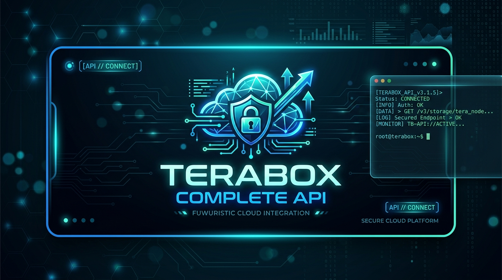
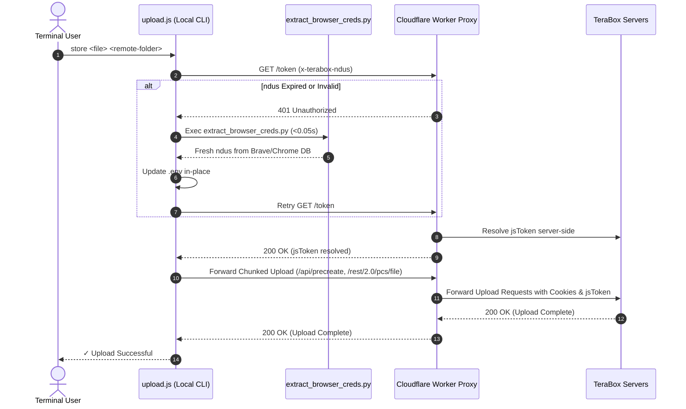

<p align="center">
  
</p>

<h1 align="center">Terabox Complete API</h1>

<p align="center">
  <b>Production-Grade TeraBox CLI File Uploader & Cloudflare Worker Server-Side Token Proxy</b>
</p>

<p align="center">
  <a href="LICENSE"></a>
  
  
  
</p>

---

## 🚀 One-Line Installation (Linux Systems)

To install **Terabox Complete API** on Linux systems (Arch Linux / Manjaro / EndeavourOS / Fedora / Ubuntu), simply run:

```bash
yay -S teraapi-full
```

*Or install globally via Node package manager:*
```bash
npm install -g @vinayakghai/terabox-complete-api
```

Once installed, use `stt`, `storetera`, or **`teraapi-full`** anywhere in your terminal!

---

## ⚡ The Problem

**TeraBox does not provide official personal-use API keys or developer portal access.**

Developers wanting to automate file uploads, create headless backups, or build CLI storage integrations are typically forced into heavy browser automation frameworks (Playwright/Puppeteer) that spawn visible Chromium windows, steal window manager focus, consume massive RAM, and break whenever session tokens rotate.

## 🚀 The Solution

**Terabox Complete API** provides a lightweight, production-grade CLI uploader paired with a Cloudflare Worker server-side token proxy. It resolves authentication tokens dynamically on Cloudflare's edge network, auto-heals expired sessions in **< 0.05 seconds** from your local browser DB, and detaches uploads to the background instantly (**< 3ms**) with auto-dismissing 2-second desktop notifications.

---

## Key Features

- ⚡ **Server-Side `jsToken` Resolution**: `jsToken` is **NEVER** stored, extracted, or cached locally. The Cloudflare Worker resolves it dynamically per request server-side.
- 🛡️ **Seamless Background Session Self-Healing**: If `.env`'s `TERABOX_NDUS` session cookie ever expires, the CLI automatically extracts the active session cookie directly from your local Brave/Chrome SQLite store in **0.05 seconds** in the background and resumes your upload without interruption.
- 🚫 **Zero Playwright / Zero Window Disruption**: No Chromium profile overhead, no browser popups, and no focus stealing on tiling window managers (i3, Hyprland, Sway, AwesomeWM).
- ⚙️ **Systemd 24/7 Service**: Ships with a pre-configured `systemd` user service template for 24/7 background proxy operation across system reboots.
- 📁 **Single & Batch Directory Uploads**: Seamless progress tracking, history logging (`~/.terabox_history.json`), and folder structure preservation.

---

## Architecture Flow



---

## Installation & Package Managers

### 📦 Linux Package Managers

#### 1. Debian / Ubuntu (`apt` / `dpkg`)
Download `.deb` package from Release v1.0.0 and install:
```bash
sudo apt install ./terabox-complete-api_1.0.0_amd64.deb
# OR
sudo dpkg -i terabox-complete-api_1.0.0_amd64.deb
```

#### 2. Arch Linux (`pacman` / `yay` / `paru`)
Build and install via `PKGBUILD`:
```bash
yay -S terabox-complete-api-bin
# OR manually build from PKGBUILD:
makepkg -si
```

#### 3. Fedora / RHEL (`dnf` / `rpm`)
Build RPM package using `.spec` file:
```bash
sudo dnf install nodejs python3
rpmbuild -ba terabox-complete-api.spec
```

#### 4. Node Package Manager (`npm`)
Install globally via `npm`:
```bash
npm install -g @vinayakghai/terabox-complete-api
```

### 🪟 Windows Setup Installer
Download and run **`terabox-complete-api-setup-v1.0.0.exe`** from [Releases](https://github.com/VinayakGhai/terabox-complete-api/releases/tag/v1.0.0). It automatically sets up PATH variables and opens the **LEARN IT** documentation manual.

---

### Setup Environment Variables
Copy `.env.example` to `.env`:
```bash
cp .env.example .env
```
Set your `TERABOX_NDUS` session cookie in `.env`:
```env
TERABOX_NDUS=your_ndus_cookie_here
TERABOX_WORKER_URL=http://localhost:8787
```

### 4. Deploy or Run Worker Proxy

#### Option A: Cloudflare Worker Deployment (Recommended)
Deploy directly to Cloudflare's global edge network (runs 24/7 for free with zero local background processes):
```bash
npm run worker:deploy
```
Set `TERABOX_WORKER_URL` in `.env` to your deployed `*.workers.dev` URL.

#### Option B: Local Systemd Background Service
Enable the pre-configured systemd service to run the worker locally in the background on boot:
```bash
mkdir -p ~/.config/systemd/user
cp systemd/terabox-worker.service ~/.config/systemd/user/
systemctl --user daemon-reload
systemctl --user enable --now terabox-worker.service
loginctl enable-linger $USER
```

---

## Revamped CLI Command Reference (`storetera` / `stt`)

Add these aliases to your `~/.bashrc` or `~/.zshrc`:

```bash
alias storetera="node /path/to/terabox-complete-api/upload.js"
alias stt="node /path/to/terabox-complete-api/upload.js"
```

| Revamped Command | Short Alias | Description | Execution Mode |
|---|---|---|---|
| `storetera upload <file>` | `stt upload <file> [folder]` | Upload a single file to TeraBox | Instant Background (<3ms) |
| `storetera upload --sync` | `stt upload --sync <file>` | Upload file in foreground terminal | Foreground Terminal |
| `storetera dir <folder>` | `stt dir <folder> [folder]` | Upload entire directory recursively | Instant Background |
| `storetera track` | `stt track` | View live active upload process bars & percentage | Process Monitor |
| `storetera delete <path>` | `stt delete <path>` | Purge remote file or directory on cloud | Remote File Manager |
| `storetera list [folder]` | `stt list [folder]` | List all remote files in TeraBox storage | Cloud File Manager |
| `storetera check` | `stt check` | Verify Worker proxy & session health | Health Check |
| `storetera log` | `stt log` | View formatted upload history log | History Viewer |
| `storetera clear` | `stt clear` | Clear local upload history log | Log Manager |
| `storetera help` | `stt help` | Display interactive terminal help menu | Help Navigation |

---

## Credits & Acknowledgments

This project synthesizes ideas and technical patterns from the following open-source projects (forked accountably under [@VinayakGhai](https://github.com/VinayakGhai)):

1. **[`saahiyo/terabox-gateway`](https://github.com/saahiyo/terabox-gateway)** *(Forked: [`VinayakGhai/terabox-gateway`](https://github.com/VinayakGhai/terabox-gateway))*
   - *Inspired Pattern*: Cloudflare Worker server-side `jsToken` resolution and API proxy architecture.
2. **[`Pahadi10/terabox-upload-tool`](https://github.com/Pahadi10/terabox-upload-tool)** *(Forked: [`VinayakGhai/terabox-upload-tool`](https://github.com/VinayakGhai/terabox-upload-tool))*
   - *Inspired Pattern*: Node.js chunk allocation (`/api/precreate`), PCS upload (`/rest/2.0/pcs/file`), and file creation pipeline.

---

## License

This project is licensed under the **MIT License**. See the [LICENSE](LICENSE) file for details.
