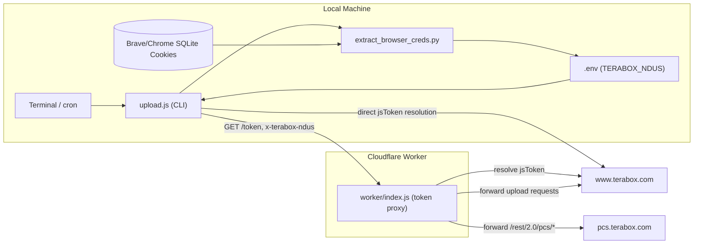
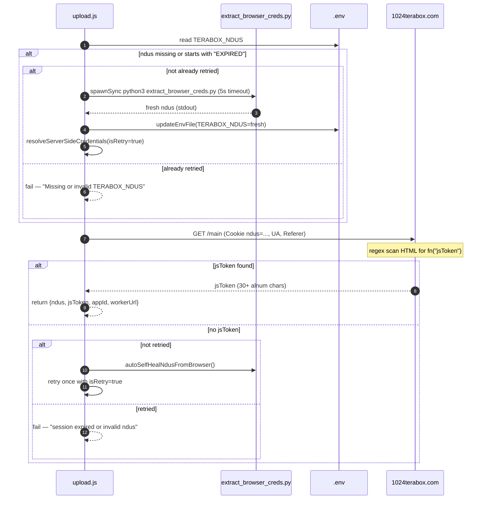
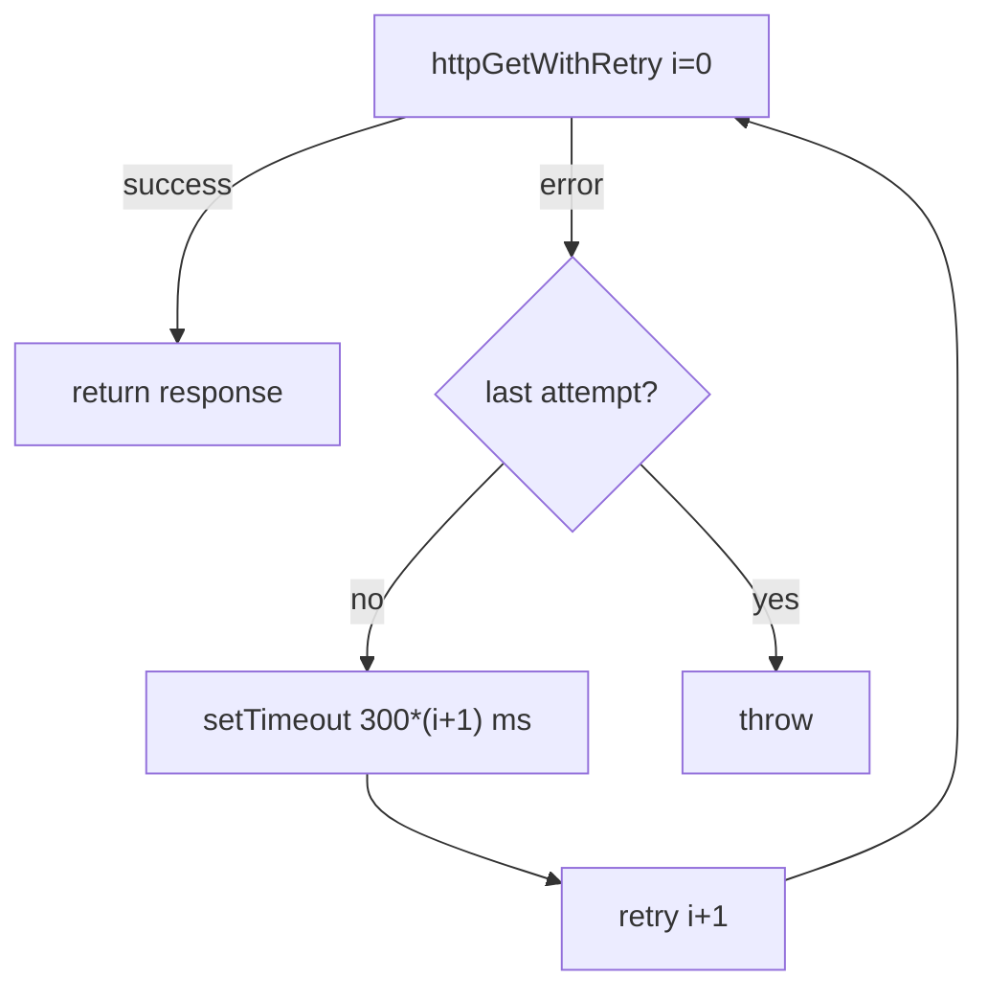
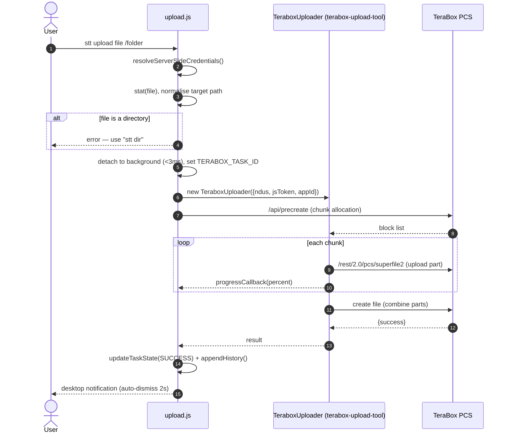
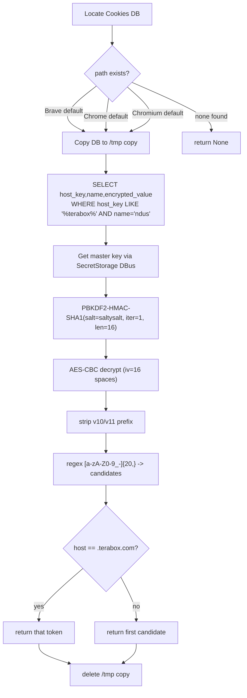
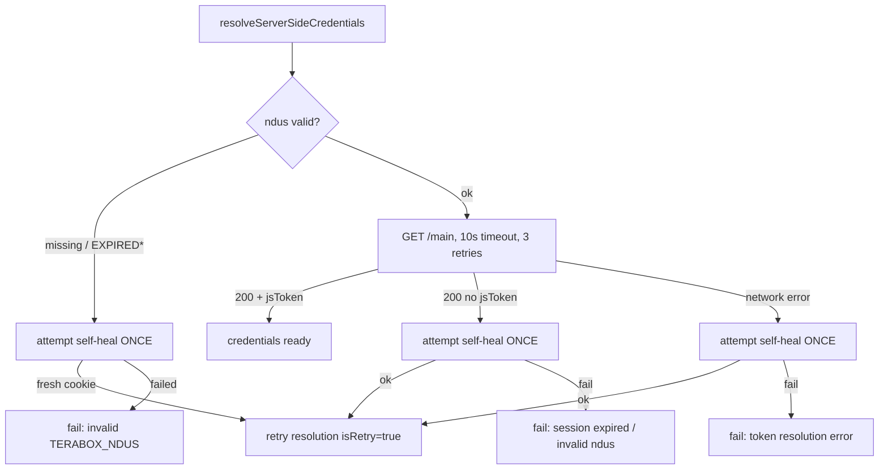

# Architecture & Data Flow Breakdown

Detailed breakdown of the **Terabox Complete API** internals: the token
resolution lifecycle, the HTTP layer (axios) mechanics, the SQLite session
extractor algorithm, and the fallback/failover rules.

> Diagrams use [Mermaid](https://mermaid.js.org/), rendered inline on GitHub.

---

## 1. Component Topology



There are two credential-resolution paths; the CLI prefers **direct
server-side resolution** against `www.1024terabox.com`, and the **worker**
acts as a proxy/token service the CLI also talks to for health checks
(`stt check`) and forwarding.

---

## 2. Token Resolution Lifecycle

`resolveServerSideCredentials(isRetry)` (`upload.js`) is the heart of auth.



Key points:

- **`isRetry` guard** ensures the browser self-heal runs at most **once** per
  resolution attempt (prevents infinite heal loops).
- The `jsToken` regex matches `fn%28%22<token>%22%29` (URL-encoded) or
  `fn("token")` in the `/main` HTML.
- Credentials are **never persisted locally**; `jsToken` is resolved fresh per
  run.

---

## 3. HTTP (axios) Layer Mechanics

The CLI configures **global axios defaults** once and uses a retry helper for
GETs:

```js
// upload.js — global defaults apply to every axios call
axios.defaults.headers.common['User-Agent']   = 'Mozilla/5.0 ... Chrome/128 ...';
axios.defaults.headers.common['Accept']       = 'application/json, ...';
axios.defaults.headers.common['Accept-Language'] = 'en-US,en;q=0.9';
axios.defaults.headers.common['Accept-Encoding'] = 'gzip, deflate, br';
axios.defaults.headers.common['Referer']      = 'https://www.1024terabox.com/main';
axios.defaults.headers.common['Connection']   = 'keep-alive';
```

`httpGetWithRetry(url, options, retries = 3)` wraps `axios.get` with
**exponential-ish backoff** (`300ms * (i+1)`) and rethrows on the final
attempt:



> The project does **not** use `axios.interceptors`; the equivalent behaviour
> (shared headers + retries) is achieved via global defaults + the retry
> helper. If you add interceptors later, this is the natural place.

The worker (`worker/index.js`) mirrors this for forwarded requests: it sets a
desktop-Chrome `User-Agent`, injects `Cookie: lang=en; ndus=...;`, strips
`x-terabox-ndus` and `host` before forwarding, and uses a **4s AbortSignal**
timeout around `jsToken` resolution.

---

## 4. Request Flow — Upload



- **Background detach**: by default the upload forks to the background
  instantly; `TERABOX_TASK_ID` keys the task state so `stt track` can poll it.
- `--sync` keeps the process in the foreground instead.
- History is appended to `~/.terabox_history.json` on both success and failure.

---

## 5. SQLite Session Extractor Algorithm

`extract_browser_creds.py` recovers a fresh `ndus` cookie from the local
browser in ~0.05s with no window.



Details:

- **DB candidates** checked in order: Brave → Google Chrome → Chromium
  (`Default/Cookies`).
- **Master key** comes from the OS keyring via `secretstorage`
  (items labelled `Brave/Chrome/Chromium Safe Storage`; default fallback
  `b'peanuts'`).
- **KDF**: `PBKDF2HMAC(SHA1, salt=b'saltysalt', iterations=1, length=16)`.
- **Cipher**: AES-128-CBC, `iv = 16 × b' '`; ciphertext prefix `v10`/`v11`
  is stripped first.
- The DB is **copied to `/tmp`** before opening so it works while the browser
  is running (SQLite lock), and the copy is removed afterwards.
- Token selection prefers `.terabox.com`/`terabox.com` hosts, truncating
  >40-char candidates to their last 40 chars.

---

## 6. Fallback & Failover Rules



Summary of the rules, in priority order:

1. **Reuse local `ndus`** from `.env` if present and not `EXPIRED*`.
2. **Self-heal once** (`extract_browser_creds.py`) and update `.env` +
   `process.env` in place; then re-run resolution with `isRetry=true`.
3. **`httpGetWithRetry`** gives 3 HTTP attempts with backoff before treating
   the call as failed.
4. **Never re-heal more than once** per resolution (guards against loops).
5. **Worker fallback for secrets**: the worker uses the `TERABOX_NDUS` secret
   only if no `x-terabox-ndus` header / cookie was sent, and returns `401`
   when resolution fails so the CLI knows to self-heal.
6. **Host routing on the worker**: `/rest/*` or `/pcs/` → `pcs.terabox.com`;
   everything else → `www.terabox.com`.

---

## 7. State, History & Telemetry

| Concern | Storage | Notes |
|---|---|---|
| Session cookie | `.env` (`TERABOX_NDUS`) | refreshed in-place by self-heal |
| Upload history | `~/.terabox_history.json` | appended on success & failure; `stt log` / `stt clear` |
| Async task state | keyed by `TERABOX_TASK_ID` | `stt track` shows live progress |
| Notifications | OS desktop notification | auto-dismiss ~2s |

No `jsToken` is stored. Health checks (`stt check`) additionally hit
`/api/home/info` to confirm the connected account username/uk.

---

## See also

- [README](../README.md) — install, one-liner, high-level flow.
- [CLI Cheatsheet](CLI_CHEATSHEET.md) — all commands & flags.
- [Cloudflare Worker Guide](CLOUDFLARE_WORKER_GUIDE.md) — deploy the proxy.
- [Systemd Guide](SYSTEMD_GUIDE.md) — 24/7 operation.
